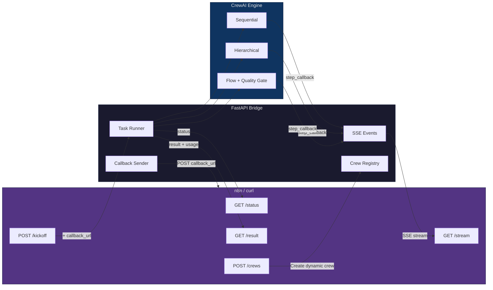
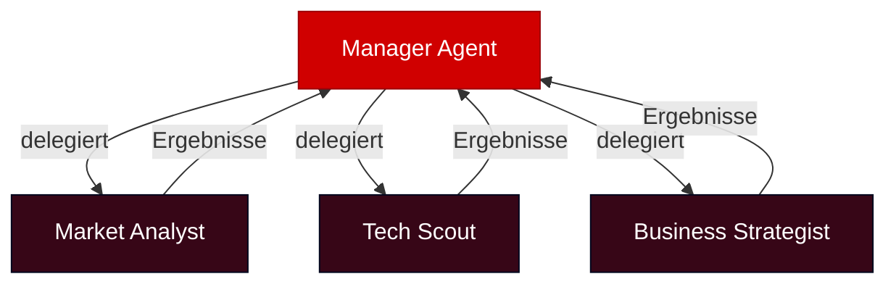
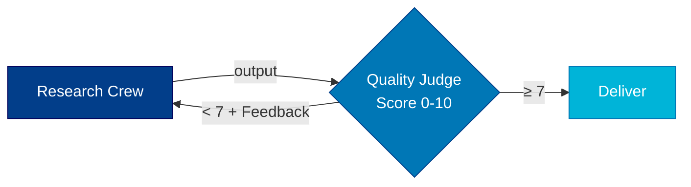

# CrewAI-n8n Bridge


FastAPI-Service der CrewAI Agent-Teams als REST-Endpoints exposed. n8n (oder jeder HTTP-Client) kann Multi-Agent-Reasoning per API-Call triggern.

- [Architektur](#architektur)
- [Tech-Stack](#tech-stack)
- [Built-in Crews](#5-built-in-crews--dynamische-crews)
- [Setup](#setup)
- [Tests](#tests)
- [API Endpoints](#api-endpoints)
- [Beispiele](#beispiel-polling-workflow)
- [n8n Integration](#n8n-integration)
- [Verifizierte Metriken](#verifizierte-metriken-alle-crews-getestet)
- [Projektstruktur](#projektstruktur)
- [Feature-Status](#feature-status)

---

## Architektur



---

## Tech-Stack

| Komponente | Tool | Version |
|---|---|---|
| Agent Framework | CrewAI | 1.14.1 |
| LLM | Claude Sonnet 4 via OpenRouter | openrouter/anthropic/claude-sonnet-4 |
| API Layer | FastAPI + Uvicorn | 0.135.3 |
| Web Search | SerperDevTool + ScrapeWebsiteTool | via crewai-tools |
| SSE Streaming | sse-starlette | 3.3.4 |
| Task State | In-Memory Dict | v1 |
| Container | Docker Compose | bridge + n8n |
| Python | 3.12.3 | |

---

## 5 Built-in Crews + Dynamische Crews

### Research Crew (Sequential)


**Input:** `{"topic": "KI im deutschen Maschinenbau 2026"}`
**Output:** Strukturierter Executive Brief (~5KB) mit Summary, Key Findings, Data Table, Implications, Sources
**Metriken:** ~6.8K Tokens, ~85s, 6 LLM Requests

### Sales Crew (Sequential)


**Input:** `{"company": "Everlast AI"}`
**Output:** KI-Lösungsvorschlag auf Deutsch (~2.3KB) mit Pain Points, Lösung, Timeline, ROI
**Metriken:** ~8K Tokens, ~70s, 6 LLM Requests

### Content Crew (Sequential)


**Input:** `{"topic": "Warum 94% der KMUs noch keine KI haben"}`
**Output:** Fertiger LinkedIn-Post auf Deutsch (~1KB) mit Hashtags, copy-paste-ready
**Metriken:** ~6.8K Tokens, ~85s, 6 LLM Requests

### Strategy Crew (Hierarchical)



**Process:** `Process.hierarchical` — Manager-Agent verteilt Tasks dynamisch
**Input:** `{"topic": "Voice AI für DACH Versicherungen"}`
**Output:** Strategieempfehlung (~6.5KB) mit Market Entry, Tech-Assessment, Aktionsplan
**Metriken:** 35.2K Tokens, 130s, 9 LLM Requests (Manager + 3 Workers)

### Research Flow (Flow mit Quality Gate)



**Input:** `{"topic": "Agentic AI Frameworks 2026"}`
**Output:** Qualitätsgeprüfter Research Report (~3.9KB, mind. Score 7/10)
**Metriken:** ~15K Tokens, 186s (Research + Quality Check)

---

## Setup

```bash
# Python 3.10-3.13 erforderlich
python3 --version

# Venv + Dependencies
python3 -m venv venv
source venv/bin/activate
pip install crewai 'crewai[tools]' fastapi uvicorn httpx

# Crew-Packages installieren
cd research_crew && pip install -e . && cd ..

# Environment
export OPENROUTER_API_KEY=<your-key>
export SERPER_API_KEY=<your-serper-key>  # Optional: für echte Websuche (serper.dev)
```

### Docker Compose (Alternative)

```bash
# Env-Vars setzen
export OPENROUTER_API_KEY=<your-key>
export SERPER_API_KEY=<your-serper-key>

# Starten
docker compose up -d

# → CrewAI Bridge: http://localhost:8000
# → n8n:           http://localhost:5678
```

---

## Tests

```bash
source venv/bin/activate
pip install pytest

# Alle 54 Tests (keine API-Keys nötig)
pytest tests/ -v

# Nur API-Tests
pytest tests/test_api.py -v
```

| Datei | Tests | Abdeckung |
|-------|-------|-----------|
| `test_api.py` | 15 | Alle REST-Endpoints, Status-Codes, Fehler |
| `test_crew_registry.py` | 14 | Static Crew Schemas, Felder, Process-Typen |
| `test_dynamic_crews.py` | 16 | Create/Delete Lifecycle, Validierung |
| `test_task_store.py` | 6 | TaskState Model, Event Queue |

---

## API starten

```bash
source venv/bin/activate
uvicorn app.main:app --host 0.0.0.0 --port 8000
```

Swagger UI: http://localhost:8000/docs

## API Endpoints

| Method | Endpoint | Beschreibung |
|---|---|---|
| GET | `/` | Service info + verfügbare Crews |
| GET | `/health` | Health check + aktive Tasks |
| GET | `/crews` | Details aller Crews (static + dynamic) |
| POST | `/crews` | Dynamische Crew erstellen |
| DELETE | `/crews/{name}` | Dynamische Crew löschen |
| POST | `/crews/{name}/kickoff` | Crew starten, returns `task_id` |
| GET | `/tasks/{id}/status` | Status: queued/running/completed/failed |
| GET | `/tasks/{id}/result` | Ergebnis + Token Usage + Duration |
| GET | `/tasks/{id}/stream` | SSE-Stream mit Live-Agent-Steps |

Built-in Crews: `research`, `sales`, `content`, `strategy`, `research-flow`

---

## Beispiel: Polling-Workflow

```bash
# 1. Crew starten
TASK_ID=$(curl -s -X POST http://localhost:8000/crews/research/kickoff \
  -H "Content-Type: application/json" \
  -d '{"topic": "Voice AI im DACH-Mittelstand"}' | jq -r '.task_id')
echo "Task: $TASK_ID"

# 2. Status pollen (~60s)
curl -s http://localhost:8000/tasks/$TASK_ID/status
# → {"status": "running", "current_step": "1/3 — Research Lead analyzing"}

# 3. Ergebnis abholen (inkl. Token Usage)
curl -s http://localhost:8000/tasks/$TASK_ID/result | jq '{status, duration_sec, usage, result_preview: .result[:200]}'
```

## Beispiel: Dynamische Crew erstellen

```bash
# 1. Crew definieren (Agents + Tasks + Process)
curl -s -X POST http://localhost:8000/crews \
  -H "Content-Type: application/json" \
  -d '{
    "name": "market-analysis",
    "agents": [
      {"role": "Researcher", "goal": "Find market data", "backstory": "Senior market researcher", "tools": ["web_search"]},
      {"role": "Analyst", "goal": "Analyze and summarize", "backstory": "Data analyst with 10y experience"}
    ],
    "tasks": [
      {"description": "Research {topic} market size and trends", "expected_output": "Market data report", "agent": "Researcher"},
      {"description": "Analyze findings and create executive summary", "expected_output": "Executive summary", "agent": "Analyst", "context": ["task_0"]}
    ],
    "process": "sequential"
  }' | jq .
# → {"message": "Crew 'market-analysis' created", "crew": {...}, "kickoff_url": "/crews/market-analysis/kickoff"}

# 2. Dynamische Crew starten
curl -s -X POST http://localhost:8000/crews/market-analysis/kickoff \
  -H "Content-Type: application/json" \
  -d '{"topic": "European AI Market 2026"}' | jq .

# 3. Crew löschen
curl -s -X DELETE http://localhost:8000/crews/market-analysis | jq .
```

**Erlaubte Tools:** `web_search`, `scrape_website`
**Task Context:** `"context": ["task_0", "task_1"]` — referenziert vorherige Tasks per Index

## Beispiel: SSE-Stream (Live-Agent-Steps)

```bash
# 1. Crew starten
TASK_ID=$(curl -s -X POST http://localhost:8000/crews/research/kickoff \
  -H "Content-Type: application/json" \
  -d '{"topic": "Voice AI im DACH-Mittelstand"}' | jq -r '.task_id')

# 2. SSE-Stream öffnen (kein Polling nötig)
curl -N http://localhost:8000/tasks/$TASK_ID/stream
# event: agent_start
# data: {"agent": "Research Lead", "step": "1/3"}
#
# event: agent_complete
# data: {"agent": "Research Lead", "step": "1/3", "output_preview": "..."}
#
# event: agent_start
# data: {"agent": "Data Analyst", "step": "2/3"}
#
# event: agent_complete
# data: {"agent": "Data Analyst", "step": "2/3", "output_preview": "..."}
#
# event: agent_start
# data: {"agent": "Report Writer", "step": "3/3"}
#
# event: agent_complete
# data: {"agent": "Report Writer", "step": "3/3", "output_preview": "..."}
#
# event: task_complete
# data: {"crew_name": "research", "duration_sec": 85.2, "status": "completed"}
```

**Events:** `agent_start`, `agent_complete`, `task_complete`, `error`

## Beispiel: Callback-Workflow (kein Polling nötig)

```bash
curl -s -X POST http://localhost:8000/crews/research/kickoff \
  -H "Content-Type: application/json" \
  -d '{
    "topic": "Voice AI im DACH-Mittelstand",
    "callback_url": "http://your-n8n:5678/webhook/crewai-callback"
  }'
# → Crew läuft → POST an callback_url mit vollem Result + Usage
```

---

## n8n Integration

Workflow-Templates in `n8n/`:
- `research-crew-workflow.json` — Webhook trigger → CrewAI kickoff → respond
- `callback-receiver-workflow.json` — Empfängt Crew-Results via Callback

**Import:** n8n UI → Workflows → Import from File → JSON auswählen

**n8nac (as-code):**
```bash
npm install --save-dev n8n-as-code
npx n8nac init-auth --host http://<n8n-host>:5678 --api-key "<key>"
npx n8nac init-project --project-index 1 --sync-folder workflows
npx n8nac push    # Workflows zu n8n pushen
npx n8nac list    # Aktive Workflows anzeigen
```

---

## Verifizierte Metriken (alle Crews getestet)

| Crew | Process | Tokens | Duration | Requests | Output | Getestet |
|------|---------|--------|----------|----------|--------|----------|
| Research | Sequential | 6.8K | 85s | 6 | 4.7KB Executive Brief | 2026-04-13 |
| Sales | Sequential | ~8K | ~70s | 6 | 2.3KB Lösungsvorschlag | 2026-04-13 |
| Content | Sequential | 6.8K | 85s | 6 | 1KB LinkedIn-Post | 2026-04-13 |
| Strategy | Hierarchical | 35.2K | 130s | 9 | 6.5KB Strategie | 2026-04-13 |
| Research Flow | Flow | ~15K | 186s | 7+ | 3.9KB Report (scored) | 2026-04-13 |

---

<details>
<summary><strong>Was funktioniert hat</strong></summary>

- **OpenRouter + LiteLLM:** Model-String `openrouter/anthropic/claude-sonnet-4` in agents.yaml — LiteLLM routet automatisch
- **@CrewBase + YAML:** Saubere Trennung von Agent-Config und Code (built-in Crews)
- **Dynamic Crews:** Runtime Crew-Erstellung via API — Agents/Tasks/Process als JSON, sofort kickoff-bar
- **Background Threads:** Mehrere Crews können parallel laufen
- **Sequential Process:** Vorhersagbare Ergebnisse, Agents bauen aufeinander auf via `context`
- **Hierarchical Process:** Manager-Agent verteilt Tasks dynamisch an Worker-Agents
- **CrewAI Flows:** Flow mit Quality Gate — automatischer Retry bei niedrigem Score
- **SerperDevTool:** Echte Websuche, Agents liefern aktuelle Daten statt LLM-Halluzinationen
- **Token Tracking:** Result-Endpoint liefert `usage` (total_tokens, prompt_tokens, completion_tokens) und `duration_sec`
- **SSE Streaming:** Live-Agent-Steps via `GET /tasks/{id}/stream` — thread-safe Queue + CrewAI step_callback/task_callback
- **Webhook Callbacks:** Optional `callback_url` — eliminiert Polling

</details>

<details>
<summary><strong>Was wir gelernt haben</strong></summary>

- OpenRouter Model-IDs haben **keinen Datums-Suffix** (`claude-sonnet-4`, nicht `claude-sonnet-4-20250514`)
- `crewai run` erstellt eigene `.venv` mit `uv` — für FastAPI importieren wir die Crew-Klassen direkt
- `OPENROUTER_API_KEY` wird von LiteLLM automatisch erkannt
- `Process.hierarchical` braucht `manager_llm` als `LLM()`-Objekt mit explizitem `max_tokens` — sonst fordert der Manager bis zu 64K Tokens an
- CrewAI Flows: `@router()` → `@listen("label")` Cycles verursachen Infinite Loops — lineares Flow-Pattern mit `while`-Loop ist robuster
- `CrewOutput.token_usage` enthält Token-Metriken direkt nach kickoff()
- Hierarchical Process braucht ~5x mehr Tokens als Sequential (Manager-Overhead)

</details>

---

## Projektstruktur

```
crewai-n8n-bridge/
├── app/
│   ├── main.py                  ← FastAPI Endpoints (REST + SSE)
│   ├── models.py                ← Pydantic Models (Task, Crew, Dynamic)
│   └── runner.py                ← Crew Runner, SSE Events, Callbacks
├── research_crew/
│   └── src/research_crew/       ← Sequential: Research → Data → Report
├── sales_crew/
│   └── src/sales_crew/          ← Sequential: Company → Pitch → Offer
├── content_crew/
│   └── src/content_crew/        ← Sequential: Research → Write → Edit
├── strategy_crew/
│   └── src/strategy_crew/       ← Hierarchical: Manager → Workers
├── flows/
│   └── research_flow.py         ← Flow: Research + Quality Gate
├── n8n/
│   ├── research-crew-workflow.json
│   └── callback-receiver-workflow.json
├── workflows/                   ← n8nac TypeScript workflows (pushed to n8n)
│   └── .../CrewAI Research Bridge.workflow.ts
│   └── .../CrewAI Callback Receiver.workflow.ts
├── tests/
│   ├── conftest.py              ← Fixtures (mock crews, test client)
│   ├── test_api.py              ← REST-Endpoint Tests
│   ├── test_crew_registry.py    ← Crew-Schema Tests
│   ├── test_dynamic_crews.py    ← Dynamic Crew Lifecycle Tests
│   └── test_task_store.py       ← Task State + Event Queue Tests
├── Dockerfile
├── docker-compose.yml           ← bridge + n8n
├── n8nac-config.json            ← n8nac workspace config
├── AGENTS.md                    ← n8nac AI context
├── CLAUDE.md                    ← AI assistant context
└── README.md
```

---

## Feature-Status

- [x] CrewAI Crews (Research, Sales, Content) — alle verifiziert
- [x] FastAPI async wrapper mit Background Threads
- [x] Webhook Callbacks (optional callback_url)
- [x] n8n Workflow Templates (JSON + n8nac TypeScript)
- [x] n8n E2E via n8nac — Workflows pushed und live
- [x] SerperDevTool (echte Websuche) + ScrapeWebsiteTool
- [x] Dynamische Crew-Erstellung via POST /crews (Agent/Task/Process als JSON)
- [x] SSE Streaming für Live-Agent-Steps (step_callback + task_callback)
- [x] Token/Cost Tracking pro Crew-Run
- [x] CrewAI Flows mit Quality Gate — verifiziert
- [x] Hierarchical Process (Strategy Crew) — verifiziert
- [x] Docker Compose (bridge + n8n)
- [x] pytest Test-Suite (54 Tests, kein API-Key nötig)
