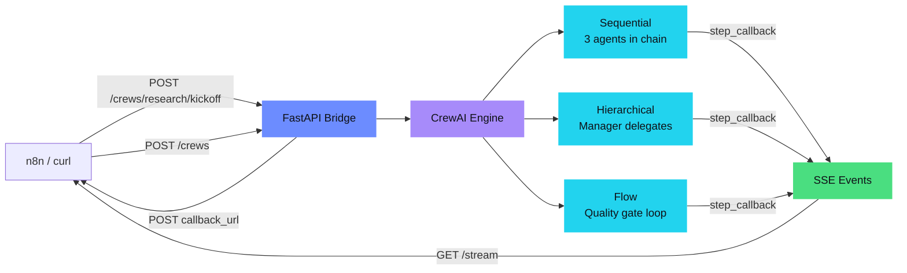
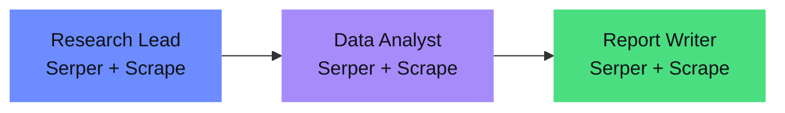
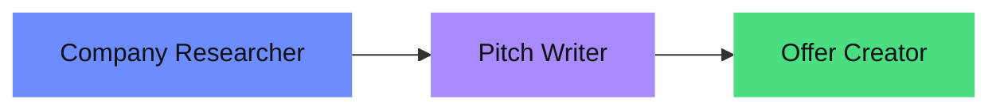
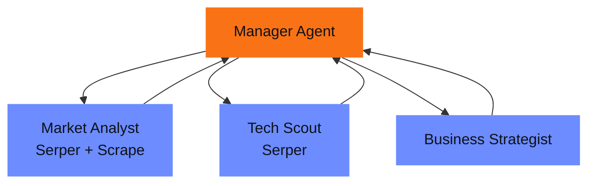
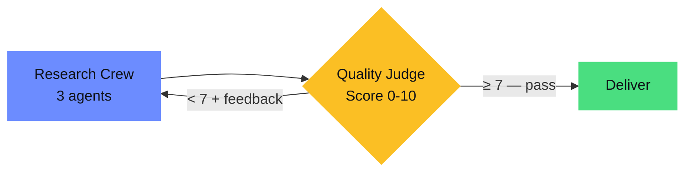

# CrewAI-n8n Bridge

[](#verified-metrics)
[](#tests)
[](#tech-stack)
[](#setup)
[](#docker-compose)

**FastAPI service that exposes CrewAI multi-agent crews as REST endpoints.** 5 built-in crews plus dynamic crew creation at runtime — sequential, hierarchical, and flow-based processes. SSE streaming for live agent progress, webhook callbacks, and full token tracking. n8n or any HTTP client can trigger multi-agent reasoning via API. Crews average 6.8K-35K tokens, 70-186s runtime, $0.02-0.15 per run via OpenRouter.

## Table of Contents

- [Architecture](#architecture) — how the bridge connects clients to CrewAI
- [Built-in Crews](#built-in-crews) — 5 pre-configured crews with verified metrics
- [Setup](#setup) — Python venv or Docker Compose
- [Tests](#tests) — 54 pytest tests, no API keys needed
- [API Endpoints](#api-endpoints) — full REST API reference
- [Dynamic Crews](#example-dynamic-crew-creation) — create custom crews at runtime
- [SSE Streaming](#example-sse-stream) — live agent step events
- [n8n Integration](#n8n-integration) — workflow templates and n8nac
- [Verified Metrics](#verified-metrics) — real performance data from test runs
- [Project Structure](#project-structure)
- [Feature Status](#feature-status)

## Architecture



Three ways to get results: **poll** (`GET /status` → `GET /result`), **stream** (`GET /stream` for SSE events), or **callback** (webhook POST on completion).

---

## Built-in Crews

### Research Crew (Sequential)



**Input:** `{"topic": "AI in German manufacturing 2026"}`
**Output:** Structured executive brief (~5KB) with summary, key findings, data table, implications, sources
**Metrics:** ~6.8K tokens, ~85s, 6 LLM requests

### Sales Crew (Sequential)



**Input:** `{"company": "Everlast AI"}`
**Output:** AI solution proposal (~2.3KB) with pain points, solution, timeline, ROI
**Metrics:** ~8K tokens, ~70s, 6 LLM requests

### Content Crew (Sequential)


**Input:** `{"topic": "Why 94% of SMBs still don't use AI"}`
**Output:** Ready-to-post LinkedIn article (~1KB) with hashtags, copy-paste-ready
**Metrics:** ~6.8K tokens, ~85s, 6 LLM requests

### Strategy Crew (Hierarchical)



**Process:** `Process.hierarchical` — manager agent distributes tasks dynamically
**Input:** `{"topic": "Voice AI for DACH insurance"}`
**Output:** Strategy recommendation (~6.5KB) with market entry, tech assessment, action plan
**Metrics:** 35.2K tokens, 130s, 9 LLM requests (manager + 3 workers)

### Research Flow (Quality Gate)



**Input:** `{"topic": "Agentic AI Frameworks 2026"}`
**Output:** Quality-checked research report (~3.9KB, minimum score 7/10)
**Metrics:** ~15K tokens, 186s (research + quality check)

---

## Tech Stack

| Component | Tool | Version |
|---|---|---|
| Agent Framework | CrewAI | 1.14.1 |
| LLM | Claude Sonnet 4 via OpenRouter | openrouter/anthropic/claude-sonnet-4 |
| API Layer | FastAPI + Uvicorn | 0.135.3 |
| Web Search | SerperDevTool + ScrapeWebsiteTool | via crewai-tools |
| SSE Streaming | sse-starlette | 3.3.4 |
| Task State | In-Memory Dict | v1 |
| Container | Docker Compose | bridge + n8n |
| Python | 3.12.3 | |

## Setup

```bash
# Python 3.10-3.13 required
python3 --version

# Venv + dependencies
python3 -m venv venv
source venv/bin/activate
pip install crewai 'crewai[tools]' fastapi uvicorn httpx

# Install crew packages
cd research_crew && pip install -e . && cd ..

# Environment
export OPENROUTER_API_KEY=<your-key>
export SERPER_API_KEY=<your-serper-key>  # Optional: for real web search (serper.dev)
```

### Docker Compose

```bash
export OPENROUTER_API_KEY=<your-key>
export SERPER_API_KEY=<your-serper-key>

docker compose up -d

# → CrewAI Bridge: http://localhost:8000
# → n8n:           http://localhost:5678
```

## Tests

54 tests covering all endpoints, models, and validation — no API keys needed.

```bash
source venv/bin/activate
pip install pytest
pytest tests/ -v
```

| File | Tests | Coverage |
|------|-------|----------|
| `test_api.py` | 15 | All REST endpoints, status codes, error cases |
| `test_crew_registry.py` | 14 | Static crew schemas, fields, process types |
| `test_dynamic_crews.py` | 16 | Create/delete lifecycle, all validation rules |
| `test_task_store.py` | 6 | TaskState model, event queue behavior |

---

## Start the Server

```bash
source venv/bin/activate
uvicorn app.main:app --host 0.0.0.0 --port 8000
```

Swagger UI: http://localhost:8000/docs

## API Endpoints

| Method | Endpoint | Description |
|---|---|---|
| GET | `/` | Service info + available crews |
| GET | `/health` | Health check + active task count |
| GET | `/crews` | All crews (static + dynamic) |
| POST | `/crews` | Create a dynamic crew |
| DELETE | `/crews/{name}` | Delete a dynamic crew |
| POST | `/crews/{name}/kickoff` | Start crew, returns `task_id` |
| GET | `/tasks/{id}/status` | Status: queued/running/completed/failed |
| GET | `/tasks/{id}/result` | Result + token usage + duration |
| GET | `/tasks/{id}/stream` | SSE stream of live agent steps |

Built-in crews: `research`, `sales`, `content`, `strategy`, `research-flow`

---

## Example: Polling Workflow

```bash
# 1. Start crew
TASK_ID=$(curl -s -X POST http://localhost:8000/crews/research/kickoff \
  -H "Content-Type: application/json" \
  -d '{"topic": "Voice AI in DACH mid-market"}' | jq -r '.task_id')
echo "Task: $TASK_ID"

# 2. Poll status (~60s)
curl -s http://localhost:8000/tasks/$TASK_ID/status
# → {"status": "running", "current_step": "1/3 — Research Lead analyzing"}

# 3. Get result (includes token usage)
curl -s http://localhost:8000/tasks/$TASK_ID/result | jq '{status, duration_sec, usage, result_preview: .result[:200]}'
```

## Example: Dynamic Crew Creation

```bash
# 1. Define crew (agents + tasks + process)
curl -s -X POST http://localhost:8000/crews \
  -H "Content-Type: application/json" \
  -d '{
    "name": "market-analysis",
    "agents": [
      {"role": "Researcher", "goal": "Find market data", "backstory": "Senior market researcher", "tools": ["web_search"]},
      {"role": "Analyst", "goal": "Analyze and summarize", "backstory": "Data analyst with 10y experience"}
    ],
    "tasks": [
      {"description": "Research {topic} market size and trends", "expected_output": "Market data report", "agent": "Researcher"},
      {"description": "Analyze findings and create executive summary", "expected_output": "Executive summary", "agent": "Analyst", "context": ["task_0"]}
    ],
    "process": "sequential"
  }' | jq .

# 2. Kickoff dynamic crew
curl -s -X POST http://localhost:8000/crews/market-analysis/kickoff \
  -H "Content-Type: application/json" \
  -d '{"topic": "European AI Market 2026"}' | jq .

# 3. Delete crew
curl -s -X DELETE http://localhost:8000/crews/market-analysis | jq .
```

**Allowed tools:** `web_search`, `scrape_website`
**Task context:** `"context": ["task_0", "task_1"]` — references earlier tasks by index

## Example: SSE Stream

```bash
# 1. Start crew
TASK_ID=$(curl -s -X POST http://localhost:8000/crews/research/kickoff \
  -H "Content-Type: application/json" \
  -d '{"topic": "Voice AI in DACH mid-market"}' | jq -r '.task_id')

# 2. Open SSE stream (no polling needed)
curl -N http://localhost:8000/tasks/$TASK_ID/stream
# event: agent_start
# data: {"agent": "Research Lead", "step": "1/3"}
#
# event: agent_complete
# data: {"agent": "Research Lead", "step": "1/3", "output_preview": "..."}
#
# event: agent_start
# data: {"agent": "Data Analyst", "step": "2/3"}
#
# event: agent_complete
# data: {"agent": "Data Analyst", "step": "2/3", "output_preview": "..."}
#
# event: task_complete
# data: {"crew_name": "research", "duration_sec": 85.2, "status": "completed"}
```

**Events:** `agent_start`, `agent_complete`, `task_complete`, `error`

## Example: Callback Workflow

```bash
curl -s -X POST http://localhost:8000/crews/research/kickoff \
  -H "Content-Type: application/json" \
  -d '{
    "topic": "Voice AI in DACH mid-market",
    "callback_url": "http://your-n8n:5678/webhook/crewai-callback"
  }'
# → Crew runs → POSTs full result + usage to callback_url
```

---

## n8n Integration

Workflow templates in `n8n/`:
- `research-crew-workflow.json` — Webhook trigger → CrewAI kickoff → respond
- `callback-receiver-workflow.json` — Receives crew results via callback

**Import:** n8n UI → Workflows → Import from File → select JSON

**n8nac (as-code):**
```bash
npm install --save-dev n8n-as-code
npx n8nac init-auth --host http://<n8n-host>:5678 --api-key "<key>"
npx n8nac init-project --project-index 1 --sync-folder workflows
npx n8nac push    # Push workflows to n8n
npx n8nac list    # Show active workflows
```

---

## Verified Metrics

All metrics from actual test runs on 2026-04-13:

| Crew | Process | Tokens | Duration | Requests | Output |
|------|---------|--------|----------|----------|--------|
| Research | Sequential | 6.8K | 85s | 6 | 4.7KB Executive Brief |
| Sales | Sequential | ~8K | ~70s | 6 | 2.3KB Solution Proposal |
| Content | Sequential | 6.8K | 85s | 6 | 1KB LinkedIn Post |
| Strategy | Hierarchical | 35.2K | 130s | 9 | 6.5KB Strategy Report |
| Research Flow | Flow | ~15K | 186s | 7+ | 3.9KB Report (scored) |

---

<details>
<summary><strong>What worked well</strong></summary>

- **OpenRouter + LiteLLM:** Model string `openrouter/anthropic/claude-sonnet-4` in agents.yaml — LiteLLM routes automatically
- **@CrewBase + YAML:** Clean separation of agent config and code (built-in crews)
- **Dynamic Crews:** Runtime crew creation via API — agents/tasks/process as JSON, immediately kickoff-able
- **Background Threads:** Multiple crews can run in parallel
- **Sequential Process:** Predictable results, agents build on each other via `context`
- **Hierarchical Process:** Manager agent distributes tasks dynamically to workers
- **CrewAI Flows:** Flow with quality gate — automatic retry on low score
- **SerperDevTool:** Real web search, agents deliver current data instead of LLM hallucinations
- **Token Tracking:** Result endpoint returns `usage` (total_tokens, prompt_tokens, completion_tokens) and `duration_sec`
- **SSE Streaming:** Live agent steps via `GET /tasks/{id}/stream` — thread-safe queue + CrewAI step_callback/task_callback
- **Webhook Callbacks:** Optional `callback_url` — eliminates polling

</details>

<details>
<summary><strong>Lessons learned</strong></summary>

- OpenRouter model IDs have **no date suffix** (`claude-sonnet-4`, not `claude-sonnet-4-20250514`)
- `crewai run` creates its own `.venv` with `uv` — for FastAPI we import the crew classes directly
- `OPENROUTER_API_KEY` is recognized automatically by LiteLLM
- `Process.hierarchical` needs `manager_llm` as an `LLM()` object with explicit `max_tokens` — otherwise the manager requests up to 64K tokens
- CrewAI Flows: `@router()` → `@listen("label")` cycles cause infinite loops — linear flow pattern with `while` loop is more robust
- `CrewOutput.token_usage` contains token metrics directly after `kickoff()`
- Hierarchical process uses ~5x more tokens than sequential (manager overhead)

</details>

---

## Project Structure

```
crewai-n8n-bridge/
├── app/
│   ├── main.py                  ← FastAPI endpoints (REST + SSE)
│   ├── models.py                ← Pydantic models (Task, Crew, Dynamic)
│   └── runner.py                ← Crew runner, SSE events, callbacks
├── research_crew/
│   └── src/research_crew/       ← Sequential: Research → Data → Report
├── sales_crew/
│   └── src/sales_crew/          ← Sequential: Company → Pitch → Offer
├── content_crew/
│   └── src/content_crew/        ← Sequential: Research → Write → Edit
├── strategy_crew/
│   └── src/strategy_crew/       ← Hierarchical: Manager → Workers
├── flows/
│   └── research_flow.py         ← Flow: Research + Quality Gate
├── n8n/
│   ├── research-crew-workflow.json
│   └── callback-receiver-workflow.json
├── workflows/                   ← n8nac TypeScript workflows (pushed to n8n)
├── tests/                       ← 54 pytest tests (no API keys needed)
├── Dockerfile
├── docker-compose.yml           ← bridge + n8n
├── CLAUDE.md                    ← AI assistant context
└── README.md
```

---

## Feature Status

- [x] CrewAI Crews (Research, Sales, Content) — all verified
- [x] FastAPI async wrapper with background threads
- [x] Webhook callbacks (optional callback_url)
- [x] n8n workflow templates (JSON + n8nac TypeScript)
- [x] n8n E2E via n8nac — workflows pushed and live
- [x] SerperDevTool (real web search) + ScrapeWebsiteTool
- [x] Dynamic crew creation via POST /crews (agents/tasks/process as JSON)
- [x] SSE streaming for live agent steps (step_callback + task_callback)
- [x] Token/cost tracking per crew run
- [x] CrewAI Flows with quality gate — verified
- [x] Hierarchical process (Strategy Crew) — verified
- [x] Docker Compose (bridge + n8n)
- [x] pytest test suite (54 tests, no API key needed)
